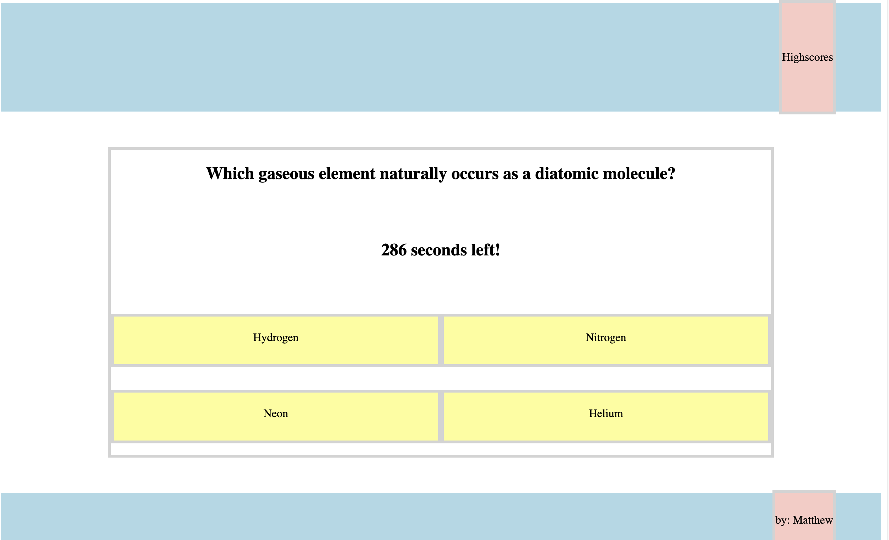

# quizzical

## Description 

This [Quizzical Website](mattdack.github.io/quizzical) provides a quiz for users to take to evaluate how nerdy and well rounded they are. The site utilizes on-click event tracking to determine user answer selection and evaluate validity. An interval timer is used to evaluate score. Javascript dynamically updates the page with new questions upon answer selection as well as CSS styling to provide real time feedback. Lastly, the site takes advantage of local storage properties to allow users to track scores on their device.

## Screenshot of Webpage

## Installation

There is no installation required or capable with this repository. Running the index.html file in a default browser renders a landing page to begin quiz taking. At the end of the quiz the users are directed to the highscores page which is also accessible via the highscores button in the navbar.

## Usage 

Select the "Start Quizzin!" button to initiate quiz. Select the yellow answer boxes after choosing an answer. Enter username at end of the quiz. View highscores by selecting the link in the navigation bar.

## Credits

 Matthew Dacanay created the entirety of this webpage. Technical concepts and public resources were referred to as needed. You can find other projects by Matthew at his [github page](github.com/mattdack).